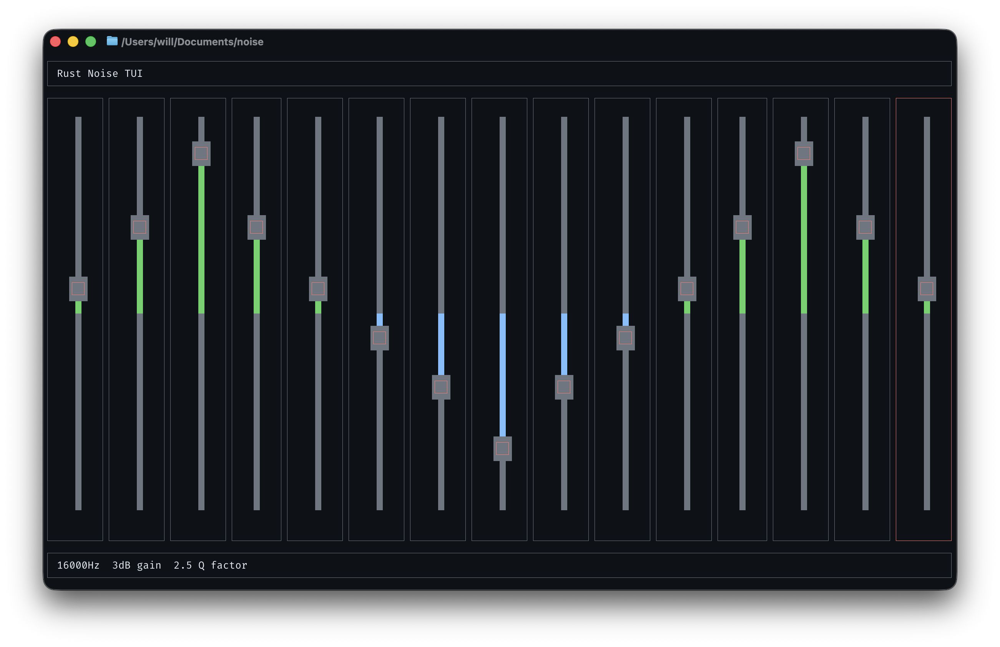

# noise

`noise` is a terminal UI for shaping generated white noise with a 15-band equalizer.
It opens your default audio output device, plays noise continuously, and lets you adjust each EQ band from the keyboard.



## Features

- 15 fixed EQ bands: `25`, `40`, `63`, `100`, `160`, `250`, `400`, `630`, `1000`, `1600`, `2500`, `4000`, `6300`, `10000`, and `16000` Hz
- Gain range of `-40 dB` to `+40 dB`
- Fixed `Q` factor of `2.5`
- Prints the final EQ curve as JSON when you exit
- Can start from a JSON preset passed on the command line

## Running

With Cargo:

```bash
cargo run --release
```

With Nix:

```bash
nix run
```

Example with a preset:

```bash
cargo run --release -- -p '[0,0,0,3,3,0,0,-3,-3,0,0,0,0,0,0]'
```

You can also pass the preset JSON without `-p`:

```bash
cargo run --release -- '[0,0,0,3,3,0,0,-3,-3,0,0,0,0,0,0]'
```

## Flags

- `-p <JSON>` / `--preset <JSON>`: use a JSON array of initial band gains
- `<JSON>`: optional positional form of the same preset input
- `-h` / `--help`: show command help

The value must be a JSON array of 15 gain values, one per band, in this order:

```text
25, 40, 63, 100, 160, 250, 400, 630, 1000, 1600, 2500, 4000, 6300, 10000, 16000
```

Those numbers are the band frequencies in Hz. The JSON values you provide are the starting gains, in dB, for each of those bands.

Example:

```bash
cargo run --release -- --preset '[0,0,0,3,3,0,0,-3,-3,0,0,0,0,0,0]'
```

To see the generated CLI help:

```bash
cargo run --release -- --help
```

## Controls

- `h`, `Left`, or `Shift+Tab`: move to the previous band
- `l`, `Right`, or `Tab`: move to the next band
- `j` or `Down`: decrease the selected band's gain by `3 dB`
- `k` or `Up`: increase the selected band's gain by `3 dB`
- `q` or `Esc`: quit and print the current settings as JSON

## Output

When the app exits, it prints the current EQ values to stdout as a JSON array.

Example output:

```json
[0.0,0.0,0.0,3.0,3.0,0.0,0.0,-3.0,-3.0,0.0,0.0,0.0,0.0,0.0,0.0]
```

You can feed that output back into the app later with `--preset`.
